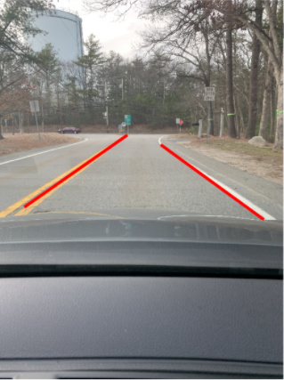
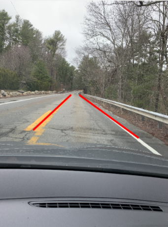
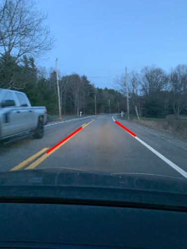
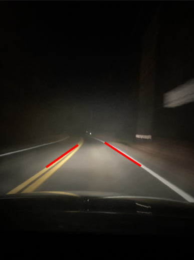

# Traffic-Lane-Detector

## Introduction
This project automatically detects traffic lanes in a given image. The image will
undergoes our lane detection pipeline which consists of:
1) convert original image to HLS color space
2) isolate yellow and white from HLS to get colored masks
3) bit-wise or yellow and white masks to get common mask
4) apply slight Gaussian blur
5) apply canny edge detection (adjusts the thresholds-trial and error) to get edges
6) define region of interest, weeds out unwanted edges detected by canny edge detector
7) retreieve hough lines
8) consolidate and extrapolate houghlines and overlay them on original image

## Experiment Results
Sunny Road

Wet Road

Dusk Road

Dark Road

## Setup and Running
1. Simply clone this code into a local directory
2. Open it in MATLAB
3. Store an image of a road scene into the resource folder
4. Run 'GUI.mlapp'
5. Select desired image and click 'detect' to see your image with dividing line overlays!

## Contributors
Yuan Gao (gaoy@wit.edu)
Wil Eddy (eddyw@wit.edu)
Tyler Crepaeu (crepeaut@wit.edu)
